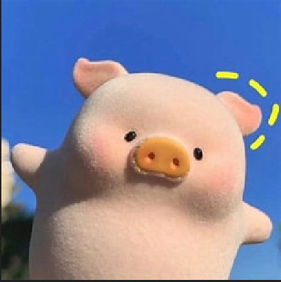
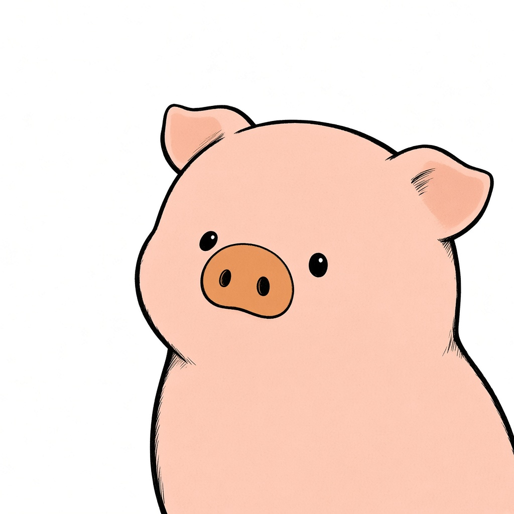

# 线稿插画头像

上传一张参考图，生成正方形线稿头像：黑线勾轮廓，线有粗细，分区淡彩平涂，背景留白。主体可以是真人、宠物，也可以是玩偶或卡通形象，画出来还是它本身。头微微转向更清楚的一侧，眼睛看回镜头。

人看这份说明。Agent 按 [SKILL.md](SKILL.md) 执行。

## 效果

小猪是玩偶，所以用 `character`；两侧脸差不多清楚，所以用 `turn-left`：头转向画面左侧，左侧留白。蓝天和背景没有被画进去。

| 参考图 | 生成的头像 |
| --- | --- |
|  |  |

## 一次出图

1. 用户给出参考图。没有参考图就停下来，请用户上传。
2. 判定主体：真人用 `person`，真实动物用 `animal`，玩偶、手办、卡通形象用 `character`。主体决定主语、配色和负面提示，选错会把小猪画成人。
3. 看哪一侧脸更清楚，让那半边朝向镜头：头转向另一侧。略清楚用 `turn-left` / `turn-right`，另一侧明显不能用时用 `three-quarter-left` / `three-quarter-right`。两边差不多时用 `turn-left`。
4. 在这个目录运行下面的命令。脚本核对图片，并打印一份 JSON。
5. Agent 用自己的生图能力出图。提示词用 JSON 里的 `prompt`，画幅用 `imageRequest.aspectRatio`，负面提示用 `imageRequest.negativePrompt`，参考图用 `imageRequest.referenceImagePaths`。这几项不要改写。

```bash
node src/cli.ts --reference "<参考图绝对路径>" --subject character --angle turn-left
```

需要 Node 24。TypeScript 由 Node 直接运行，不用安装依赖。命令成功时，JSON 打在标准输出。失败时，标准错误是一句中文，例如「缺少参考图」。

## 目录

```text
SKILL.md                         Agent 要遵守的步骤
README.md                        给人看的说明
examples/pig/before.png          小猪参考图
examples/pig/after.png           小猪线稿头像
src/cli.ts                       命令入口，从这里读代码
src/parse-args.ts                读取命令参数
src/read-reference-image.ts      确认参考图存在，并核对格式
src/subject.ts                   三种主体：真人、动物、玩偶或卡通形象
src/portrait-angle.ts            四种角度
src/line-illustration.ts         固定的线条和上色
src/build-avatar-plan.ts         把参考图和构图合成方案
src/types.ts                     请求、参考图、方案的类型
src/input-error.ts               参考图不合格时的错误
src/index.ts                     对外导出的能力
```

## 装进 Agent

```bash
npx skills add fragrans-maotou/line-illustration-avatar
```

这条命令找到根目录的 `SKILL.md`，把本目录链接到当前 Agent 的 skills 目录。Cursor 里通常是项目的 `.cursor/skills/avatar-generator`，或用户目录的 `~/.cursor/skills/avatar-generator`。装好之后，Agent 读的是 `SKILL.md`。
